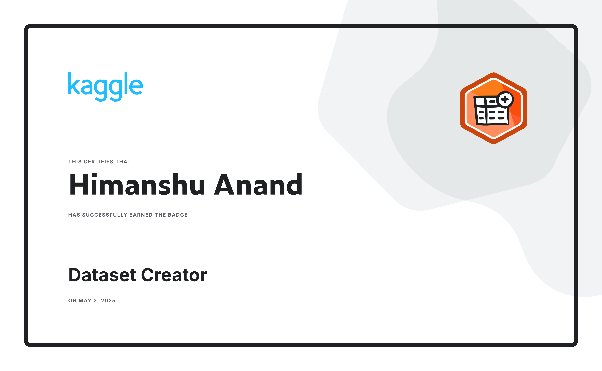
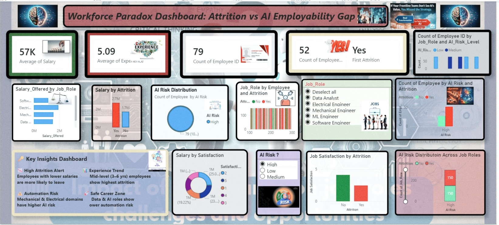

End-to-end Workforce Analytics Dashboard analyzing Attrition vs AI Risk using Excel, MySQL, Python, and Power BI

# 🚀 Workforce Analytics Dashboard: Attrition vs AI Risk

---

## 📌 Project Overview

This project analyzes employee attrition based on AI risk, salary, job satisfaction, and experience levels.
It provides insights into how automation and employability gaps are impacting workforce trends.

---

## 🎯 Objective

To identify how AI automation and employability gaps influence employee attrition and workforce stability.

---

## 🛠️ Tools & Technologies

* 📊 Excel (Data Cleaning & Preprocessing)
* 🛢️ MySQL (Data Storage & Querying)
* 🐍 Python (EDA & Visualization – Kaggle Notebook)
* 📈 Power BI (Interactive Dashboard & Insights)

---

## 🔗 Data Pipeline

Excel → MySQL → Power BI
Python used for analysis and visualization (Kaggle Notebook)

---

## 📊 Key Insights

* 🔴 Employees with lower salaries are more likely to leave
* ⚠️ High AI-risk roles show higher attrition rates
* 📉 Mid-level employees (3–6 years experience) are most affected
* 🟢 Data & AI roles show lower automation risk

---

## 🏆 Kaggle Achievement

* 📌 Created a custom workforce dataset using AI & ChatGPT
* 📊 Published dataset on Kaggle
* 🏅 Earned Kaggle Dataset Badge
* 🔍 Used this dataset for end-to-end analysis

🔗 Kaggle Dataset: https://www.kaggle.com/datasets/himanshuanand480/workforce-analytics-attrition-and-skill-dataset

### 📸 Badge Preview

Kaggle Badge: https://www.kaggle.com/certification/badges/himanshuanand480/17
---

## 📸 Dashboard Preview

---

## 🚀 Conclusion

AI automation is significantly impacting workforce behavior, especially in mid-level roles.
This project highlights the importance of upskilling and adapting to AI-driven job transformations.

---
