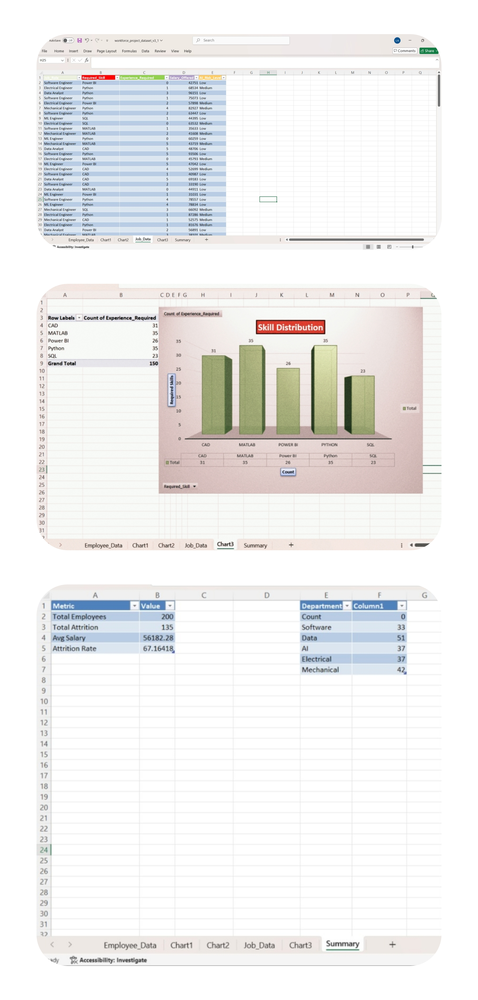

# 🚀 Workforce Analytics Dashboard: Attrition vs AI Risk

---

## 📌 Project Overview

This end-to-end project analyzes employee attrition in relation to AI risk, salary, job satisfaction, and experience levels.  
It highlights how automation and employability gaps are reshaping workforce dynamics.

---

## 🎯 Objective

To uncover how AI automation and employability gaps influence employee attrition and workforce stability, and to present actionable insights through interactive dashboards.

---

## 🛠️ Tools & Technologies

* 📊 **Excel** – Data Cleaning, Preprocessing, and Dashboarding  
* 🛢️ **MySQL** – Data Storage & Querying  
* 🐍 **Python (Kaggle Notebook)** – Exploratory Data Analysis & Visualization  
* 📈 **Power BI** – Interactive Dashboard & Insights  

---

## 🔗 Data Pipeline

**Excel → MySQL → Python (EDA) → Power BI**  
Custom dataset created and published on Kaggle.

---

## 📊 Key Insights

* 🔴 Employees with lower salaries are more likely to leave  
* ⚠️ High AI-risk roles show higher attrition rates  
* 📉 Mid-level employees (3–6 years experience) are most affected  
* 🟢 Data & AI roles show lower automation risk  

---

## 🏆 Kaggle Achievement

* 📌 Designed and published a custom workforce dataset using AI & ChatGPT  
* 📊 Dataset published on Kaggle  
* 🏅 Earned Kaggle Dataset Badge  
* 🔍 Used dataset for end-to-end analysis  

🔗 Kaggle Dataset: [Workforce Analytics Dataset](https://www.kaggle.com/datasets/himanshuanand480/workforce-analytics-attrition-and-skill-dataset)

### 📸 Badge Preview

---

## 📸 Dashboard Previews

### 🔹 Power BI Interactive Dashboard
  
*Interactive dashboard with drill-downs and dynamic filters for attrition vs AI risk.*

---

### 🔹 Excel Dashboard
  
  
*Excel-based dashboard showcasing pivot tables, charts, and attrition analysis.*

---

## 🚀 Conclusion

AI automation is significantly influencing workforce behavior, particularly among mid-level employees.  
This project demonstrates the importance of **upskilling** and **adapting to AI-driven transformations**, while showcasing end-to-end data analytics skills across **Excel, SQL, Python, and Power BI**.

---
